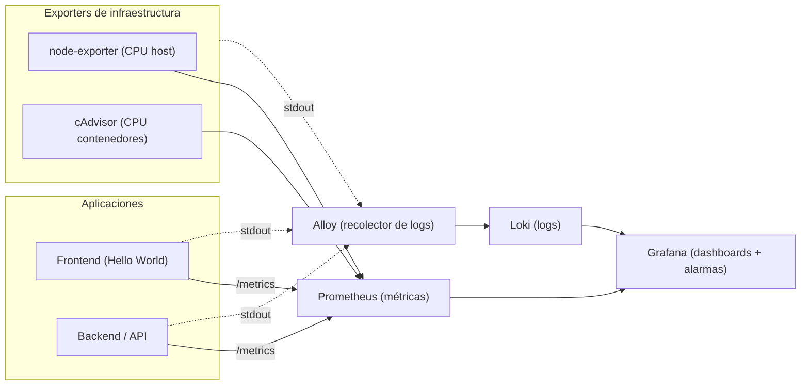

# Monitoreo Grafana, Prometheus y Loki

**Curso:** Infraestructura como Código
**Estudiante:** Mariños Gonzalez Bryan

---

## 1. Objetivos de aprendizaje

Al terminar este laboratorio serás capaz de:

1. Explicar el rol de cada componente de un stack de observabilidad (métricas, logs, visualización y recolección) y por qué se aprovisiona como código.
2. Levantar el stack completo con un único `docker compose up`, entendiendo qué provisiona cada servicio.
3. Construir un **dashboard** en Grafana que combine métricas de infraestructura y logs de aplicación e infraestructura.
4. Configurar una **alarma** que se dispare cuando el uso de CPU supere el 50% y verificar su funcionamiento.

---

## 2. Arquitectura del laboratorio



---

## 4. Prerrequisitos

- **Docker** y **Docker Compose** instalados y funcionando (`docker --version`, `docker compose version`).
- Un navegador web.
- Los archivos del proyecto entregados por el docente (carpeta del laboratorio con su `docker-compose.yml`).
- Puertos libres en tu máquina: `3000`, `3001`, `3100`, `8080`, `8081`, `9090`, `9100`, `12345`.

---

## 5. Instrucciones para despliegue

### Paso 1 — Levantar el stack

   Desde la carpeta del proyecto:

   ```bash
   docker compose up -d --build
   ```

   Una vez los contenedores esten marcados como "Pulled", luego se verifica el estado:

   ```bash
   docker compose ps
   ```

   En los servicios se debe contemplar lo siguiente:

   | Servicio   | URL                       | Qué deberías ver                        |
   |------------|---------------------------|-----------------------------------------|
   | Frontend   | http://localhost:8080     | Página "Hello World" con dos botones    |
   | Backend    | http://localhost:3001/metrics | Texto de métricas en formato Prometheus |
   | Grafana    | http://localhost:3000     | Login (usuario `admin`, clave `admin`)  |
   | Prometheus | http://localhost:9090     | Interfaz de Prometheus                   |

 ---

### Paso 2 — Ingresar a Grafana
Usar las credenciales por defecto:
- User: admin
- Pass: admin

---

### Paso 3 — Verificar el dashboard

Ingresar: **Dashboards → Evaluation → Observabilidad - Bryan Mariños**
Se deben de observar 4 paneles:
- CPU backend (%)
- CPU host (%)
- Logs de aplicación
- Logs de infraestructura

### Paso 4 — Verificar estado de alerta
Nos dirigimos al frontend desde el navegador y presionamos el boton ``Generar carga de CPU (30s)``

Ahora nos vamos a: **Alerting → Alert rules**

La alerta debe pasar de **Normal → Pending → Firing → Normal(Una vez finaliza la carga)**

---

### Paso 5 — Ver log de la alerta

Ahora volveremos a el Dashboard en el panel de `logs de aplicacion` debe de visualizarse un mensaje que contenga: **grafana_alert_received**

---
## 6. Comandos utilizados
```bash
docker compose up -d --build     # levantar / reconstruir
docker compose ps                # estado de los servicios
docker compose logs -f grafana   # seguir logs de un servicio
docker compose down              # detener (conserva dashboards)
docker compose down -v           # detener y borrar todos los datos
```